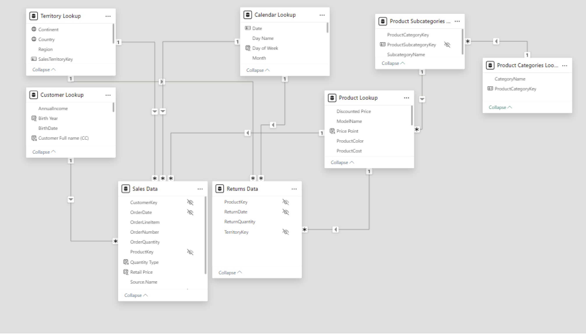
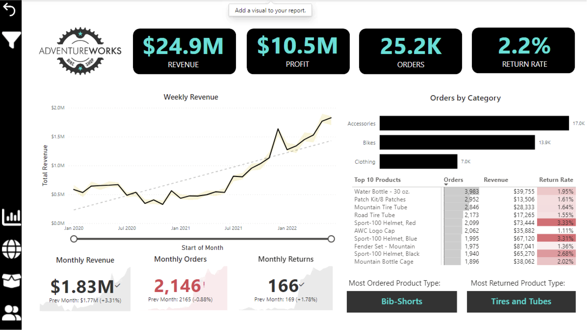
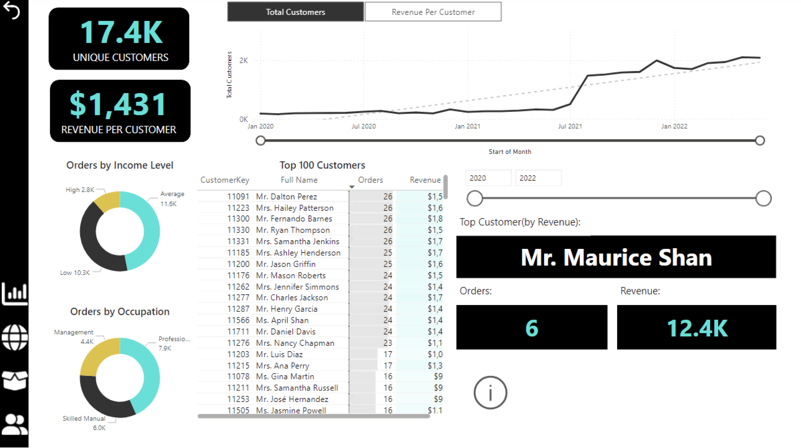
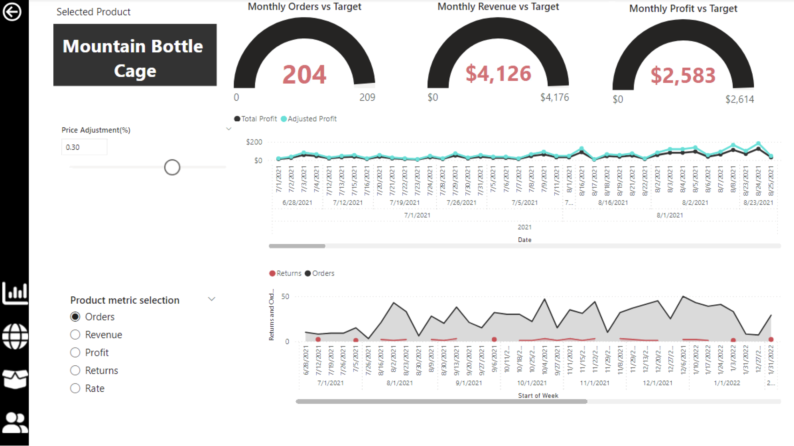

# AdventureWorks Sales Intelligence Dashboard

## 📊 Executive Summary
This project analyzes sales data for AdventureWorks, a global equipment manufacturer. The goal was to resolve data silos and enable executive leadership to track KPIs in real time. By architecting a Snowflake Schema and developing dynamic DAX measures, this solution reduced decision latency and identified key opportunities in customer segmentation and inventory optimization.

**Key Impact:**
* **Data Architecture:** Integrated 15+ tables into a unified data model.
* **Strategic Insight:** Demographic clustering revealed that **high-income ($100k+) buyers generated 2.3x higher Average Order Value (AOV)**, enabling targeted marketing campaigns to reduce returns.
* **Performance:** Designed 4 executive dashboards to track revenue, profit margins, and return rates.

---

## 🏢 Business Problem
AdventureWorks faced challenges in optimizing operations due to a lack of integration across business units. The analysis focused on four critical areas:
1.  **Sales Performance:** Evaluating strategies across regions to uncover growth opportunities.
2.  **Customer Retention:** Understanding diverse purchasing patterns to improve Customer Lifetime Value.
3.  **Product Returns:** Identifying root causes of high return rates to protect profit margins.
4.  **Inventory Management:** Forecasting demand to prevent stock shortages or surpluses.

---

## ⚙️ Technical Methodology

### 1. Data Transformation & Modeling
Raw data from the AdventureWorks SQL database was transformed using Power Query.
* **Preprocessing:** Standardized headers, parsed text delimiters, and added derived columns (e.g., Domain Name, Full Name).
* **Data Model:** Implemented a **Snowflake Schema**, connecting Fact tables (`Sales`, `Returns`) to Dimension tables (`Territory`, `Customer`, `Product`). This structure enabled complex filtering across demographics and product categories.

### 2. Advanced DAX Calculations
Over 25 DAX measures were developed to support time-series analysis and dynamic aggregation.
* **Time Intelligence:** Created measures like `Previous Month Orders` and `YTD Revenue` using `CALCULATE` and `DATESYTD`.
* **Rolling Metrics:** Implemented `10-day Rolling Revenue` to smooth daily volatility and visualize trends.
* **Scenario Analysis:** Built dynamic parameters to simulate price adjustments and their impact on profit.

*(See `DAX_Measures.md` for the code snippets)*

---

## 📈 Dashboard Showcase

### Executive Overview
**Stakeholders:** CEO, CFO, CMO.
**Insights:**
* Weekly revenue peaked in Jan 2022, suggesting strong seasonal/holiday influence.
* Identified a recent dip in monthly revenue coupled with an uptick in return rates.

### Customer Analysis
**Insights:**
* **Segmentation:** High-income professionals drive the majority of revenue.
* **Top Customer:** Mr. Maurice Shan was identified as the highest-value customer, highlighting opportunities for VIP loyalty programs.

### Product Performance
**Insights:**
* **Quality Control:** "Sport-100 Helmets" showed high return rates, flagging potential quality issues.
* **Category Trends:** Accessories and Bikes dominate order volume.

---

## 🚀 Conclusion
The final report delivered a robust analytical platform, not just a static display. It successfully empowered the sales and marketing teams to tailor strategies based on granular customer behaviors and product performance metrics.
